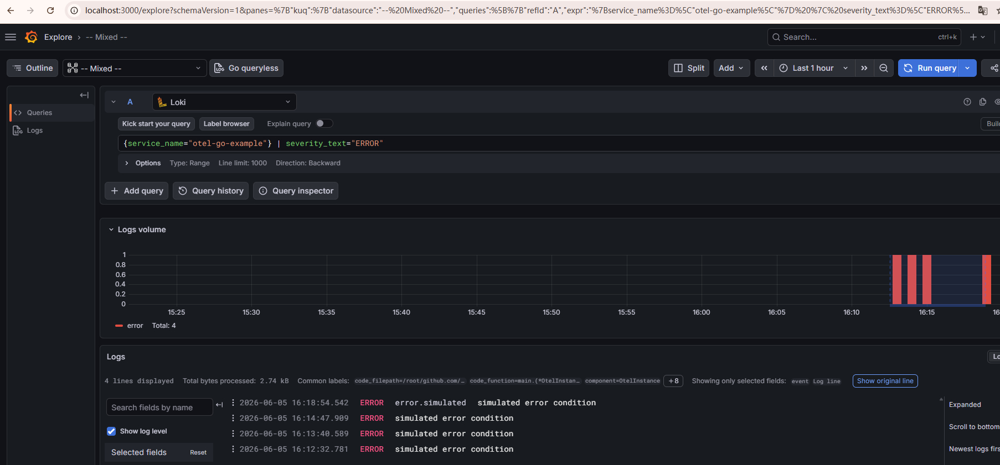

# otel-go-example

Start the services:

```bash
docker compose up -d
```

Build and ingest some logs to OpenTelemetry Collector:

```bash
go build
./otel-go-example
```
 
Then go to [Grafana](http://localhost:3000) to see the logs.



Stop the services.
